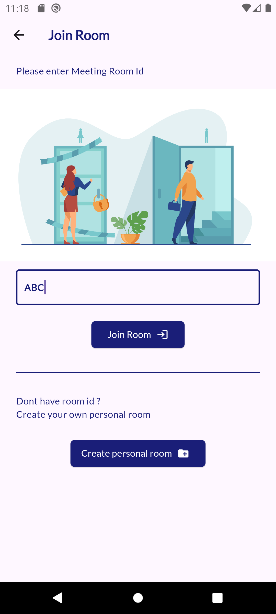

# Video-Chat App-Flutter


Video Calling App Made in Flutter with Agora.io
 
#### Supported features:
- 1-1 Video Call
- Group Video Call (4 max)

Test App by Downloading Apk From Screenshot/app.apk

#### Getting Started:

1. Clone/Download The Repo 
2. Signup/Login at https://console.agora.io/signin And get Agora App id;
3. replace Appid At lib/Helpers/utils.dart
4. run ```flutter run ```

#### Screenshots:





#### Credits:
- FlatIcons
- FreePik
- Agora.io
